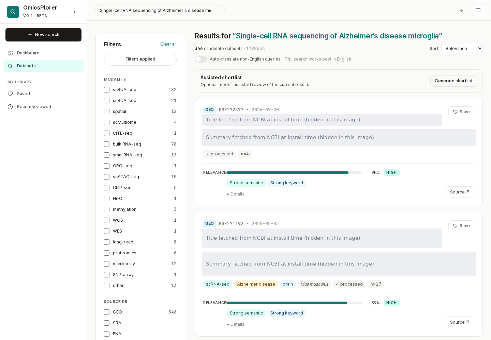

# OmicsPlorer

OmicsPlorer is a self-hostable application for collecting public omics-dataset metadata and searching it through a web interface. The repository contains the application source, data-ingestion workers, search services, and a local-LLM integration. It does not contain the production corpus, private user data, model weights, service credentials, or the frozen evaluation outputs used in a manuscript.

## What is included

| Area | Location | Role |
|---|---|---|
| Web application | `apps/web` | Search, filtering, dataset inspection, and saved-item UI |
| API | `apps/api` | Search orchestration, metadata endpoints, and application services |
| Workers | `apps/workers` | Public-source harvesting, metadata extraction, ontology mapping, and indexing |
| Infrastructure | `infra` | Container definitions, local Compose stack, and static policy checks |
| Shared packages | `packages` | Shared schemas and small security-test fixtures |

The current implementation combines lexical search, vector retrieval, and optional reranking. Local Ollama endpoints are used for model-backed functions. Whether a particular model or index is suitable depends on the corpus, hardware, and evaluation protocol; this repository does not claim a fixed response time, accuracy, or service-level guarantee.

## Try it on your computer: real-data GEO demo

The GEO demo runs the complete search path on your own computer. The path combines lexical (BM25)
retrieval, vector retrieval, reciprocal rank fusion, and cross-encoder reranking, and it searches
5,000 real GEO Series. No OmicsPlorer server is involved. Titles and summaries are downloaded from
NCBI while the demo is set up.

```bash
git clone https://github.com/jin092904/OmicsPlorer.git
cd OmicsPlorer
cp infra/compose/.env.example infra/compose/.env
# Replace both database password placeholders in infra/compose/.env with distinct local values.
make docker-demo-geo
```

When the command finishes, open <http://localhost:3000>. Before that, the command runs one search
and stops with an error unless lexical retrieval, vector retrieval, and reranking all contributed.
It prints a line such as `First search: 37.0 s; path rrf_rerank; lexical used (200 candidates),
dense used (200 candidates), reranker used`, followed by the top accessions.



*Titles and summaries are hidden in this image because the repository does not redistribute
them; the running demo shows the text it fetched from NCBI.*

**Requirements.** You need Docker Engine or Docker Desktop with Compose v2, `make`, and an
internet connection. On Windows, run the commands inside WSL 2. Everything runs on CPU, and no
GPU is needed. The two models are `qwen3-embedding:8b` through Ollama (4.7 GB) and
`Qwen/Qwen3-Reranker-0.6B` (1.2 GB).

Plan for 16 GB of RAM and 30 GB of free disk space. With Docker Desktop, give Docker at least
12 GB of memory, and more if you can. The `docker-demo-geo` workflow measured the following on a
GitHub-hosted runner with 4 vCPUs and 15 GiB of RAM on 2026-09-29:

| Measure | Value |
|---|---|
| First run of `make docker-demo-geo` | 432 s; downloads take longer on a slower connection |
| Disk space used | 20 GiB (images 12.6 GB, volumes 6.2 GB, build cache 4.6 GB) |
| Sum of the services' memory peaks | 11.4 GiB (Ollama 5.5, API with the reranker 4.1, OpenSearch 1.5), sampled every 10 s; the peaks need not coincide |
| Search time | 37 s for the first search, which loads the models; 11–15 s (median 12.6 s) for the next ten |

A second run on the same runner type was about ten times slower: the first search took 367 s,
and the run was stopped after the verification searches had not finished within 50 minutes. Memory
peaks were the same as in the first run, so the cause was not established. Expect search time to
vary with the host, and treat the values above as one observation, not a guarantee.

**Example queries.** The queries below come from the September 2026 blinded assessment. The
results listed were observed on 2026-09-27 in a native, non-Docker run of the same code and demo
data. They can shift slightly between machines.

| Query | Examples in the top 10 |
|---|---|
| Single-cell RNA sequencing of Alzheimer's disease microglia | GSE98969, GSE229418, GSE271192 |
| Single-cell RNA-seq of dopaminergic neurons in the substantia nigra in Parkinson's disease | GSE184950, GSE108020, GSE169755 |
| Paired single-cell transcriptomics of tumor and adjacent normal tissue in hepatocellular carcinoma | GSE189903, GSE326201, GSE233421 |
| `GSE98969` (accession) | GSE98969 as the first result |

**What the demo is not.** The demo is a deliberately chosen subset. It includes the GEO Series
judged in that assessment, so its rankings are not comparable with results on the full corpus, and
it does not measure retrieval quality or production latency. Query translation, AI-assisted
shortlists, and design analysis require an extraction model that the demo does not install. See
[`infra/compose/demo-geo/README.md`](infra/compose/demo-geo/README.md) for the contents, the
selection rule, and the terms of the demo data. See
[`docs/runbooks/docker-deployment.md`](docs/runbooks/docker-deployment.md) for all commands.

### Synthetic smoke test

`make docker-demo` starts the application with twelve synthetic records and a lexical index
only. It checks that the containers start and does not download models.

## Reproducibility material

Manuscript-specific protocols, frozen query sets, result tables, and figure-generation inputs belong in the separate [omicsplorer-reproducibility](https://github.com/jin092904/omicsplorer-reproducibility) repository. Keeping those artifacts separate distinguishes the versioned scientific evaluation from the evolving product source.

## Evidence and versioning

- Dependency lockfiles record the application dependency resolution used by this source snapshot.
- External services and model artifacts can change independently; record their versions, retrieval dates, and hashes for each evaluation.
- Report end-to-end user-observed latency with the corpus size, cache state, hardware, concurrency, timeout policy, and summary statistics. Do not infer production latency from one API timing or a synthetic demo.
- Do not treat planned thresholds, manual spot checks, or unexecuted CI jobs as results.
- Review the documented dependency-audit exception before deploying this snapshot.

The detailed publication boundary is in [`docs/publication-boundary.md`](docs/publication-boundary.md).

The GPB Application Note source-release procedure and claim boundary are recorded in
[`docs/gpb-public-release.md`](docs/gpb-public-release.md).

The current audit exception and its review condition are recorded in [`docs/dependency-audit-exceptions.md`](docs/dependency-audit-exceptions.md).

## Frozen-evaluation trace

`POST /api/v1/search` requests carrying `X-Eval-Mode: 1` receive an additive
`evaluation_trace` with the requested and effective retrieval modes, component
states, shared shortcut/boost states, the number of candidates each retriever
returned before fusion (`candidate_counts`), and fallback events. Ordinary
product requests omit this field. A component state of `used` only means that
the call succeeded; check `candidate_counts` to see whether it contributed any
candidates. This trace is execution evidence; it does not by itself establish
retrieval quality.

For a frozen run, mount the completed `effective-server-config.json` read-only
into the API container and set `EFFECTIVE_SERVER_CONFIG_PATH` to its in-container
path. The API hashes the parsed JSON using the reproducibility package's
canonical JSON rule. If the file is absent or invalid, the trace contains a null
configuration digest and the offline validator must reject the observation.
The configuration, deployment, corpus, and model evidence still require
independent freezing and validation in the
[reproducibility repository](https://github.com/jin092904/omicsplorer-reproducibility).

## Security

Do not commit `.env` files, database snapshots, user queries, credentials, or generated production data. Please report suspected vulnerabilities through GitHub's private vulnerability reporting flow described in [`SECURITY.md`](SECURITY.md).

## License and citation

The source is available under the GNU Affero General Public License v3.0 or later. The `private: true` field in `apps/web/package.json` only prevents accidental publication to the npm registry; it does not change the source license.

Organizations that cannot use the AGPL terms may request a separate commercial license as described in [`COMMERCIAL-LICENSE.md`](COMMERCIAL-LICENSE.md). Citation metadata is provided in [`CITATION.cff`](CITATION.cff).
